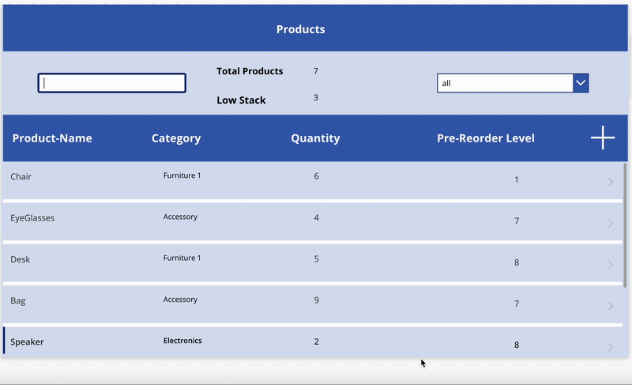
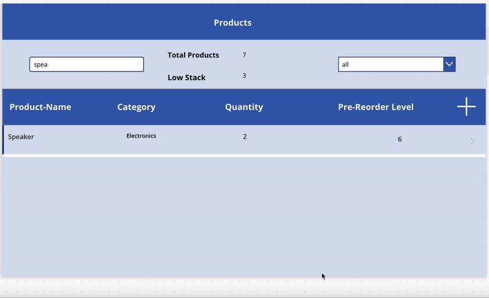

# Inventory-Management-App--Power-Apps ( power automate - share point - Canvas app) 
Built an Inventory Management System in Power Apps using SharePoint lists to centralize product data, track stock levels, and support fast lookups and updates through a user-friendly form and gallery UI. Integrated Power Automate notifications to streamline inventory changes and reduce manual follow-ups while keeping records consistent.
## Demo

## Demo Add

## Demo Automation

## Key Features
- **SharePoint-backed inventory list** (single source of truth for products and stock data)
- **Gallery + Form pattern** for fast browse → select → edit experience
- **Category filtering** (e.g., show *All* items or filter by a selected category)
- **Item details screen** for updating product information and stock levels
- **Clean data experience** using lookup, filter, and conditional logic in Power Fx

## Tech Stack
- **Power Apps (Canvas App)**
- **SharePoint Lists**
- **Power Automate **

## How It Works
1. Inventory data is stored in a SharePoint list (e.g., Product Name, Category, Quantity, Status).
2. A gallery displays inventory items and supports searching/filtering.
3. Selecting an item opens a detail form where the record can be updated.
4. Updates are saved back to SharePoint to keep inventory records consistent.

